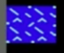
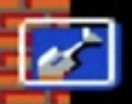

ДИЗАЙН ДОКУМЕНТ "BattleGrad"
=========================

Оглавление
-------------------------- 

1. [Общая информация](#general)
2. [Краткое описание игры](#info)
3. [Описание персонажей](#characters)
4. [Игровой мир](#world)
5. [Игровой опыт](#gameplay)
6. [Игровая механика](#mechanics)
7. [Враги](#enemies)
8. [Сюжет](#plot)

##### 
Общая информация
--------------------------  

BattleGrad

Платформы: Web
Возрастной рейтинг: 0+  

  

Вдохновлено Battle City 

##### 
Краткое описание игры
--------------------------  

Игра относится к жанру 2д-шутер, с видом сверху.
В игре будет 10 уровней (в оригинале 70, нужно будет выбрать наиболее удачные).
Игрок начинает каждый уровень возле своего штаба. Враги появляются на другом крае уровня. Цель игрока уничтожить все вражеские танки (всего на уровне респаунятся 20 вражеских танков). Игрок проигрывает если у него кончаются жизни или вражеские танки уничтожают штаб. Начинает игрок с 3 жизнями. В конце уровня потситывается награда в очках - за убитые танки, и за быстроту прохождения уровня.

##### 
Описание персонажей
--------------------------  

Игрок играет за желтый танк.  

  

Если будет реализован мультиплеер - второй игрок будет играть за зеленный танк.  

  

##### 
Игровой мир
--------------------------  

Каждый уровень состоит из клеток разных типов:

Пустые клетки  

  

Кирпичные клетки
Можно уничтожить обычными снарядами, попадание снаряда уничтожает 1/4 клетки.  

  

Металлические клетки
Можно уничтожить бронебойными снарядами, попадание снаряда уничтожает 1/4 клетки.  

  

Клетки джунглей
Скрывают игрока и вражеские танки. Никак не взаимодействуют со снарядами.  

  

Водные клетки
Через них не может передвигаться ни игрок ни вражеский танк. Со снарядами никак не взаимодействуют.  

  

Клетки со льдом
На них игрок начинает скользить, вражеские танки не начинают скользить. Со снарядами никак не взаимодействуют.  

  

##### 
Игровой опыт
--------------------------  

При старте игры игрок видит модалку с выбором количества игроков 1 или 2 (вторая кнопка задисейблена).
После выбора количества игроков появляется модалка, показано управление и кнопка далее.
При нажатие на далее модалка исчезает и начинается игра.
В начале и конце каждого уровня играет мотивирущая музыка. 
При нажатии на esc в игре, появляется модалка с возможностью закончить игру, сохраниться, перейти в форумы, в профиль или лидерборд, или посмотреть управление.

##### 
Игровая механика
--------------------------  

Бонусы звезды.  

  

Бонусы звезды выпавшие с врагов апргейдят наш танк. После первой звезды у танка повышается скорострельность и меняется вид. После второй звезды у танка еще больше повышается скорострельность и меняется вид. После третьй звезды танк начинает стрелять бронебойными снарядами пробивающими железные стены.  

  

  

  

Бонус граната.  

  

Уничтожает все вражеские танки на уровне.

Бонус дополнительная жизнь.  

  

Игроку добавляется 1 жизнь.

Бонус время.  

  

При взятии бонуса времени все вражеские танки замирают

Бонус каска.  

  

У игрока появлется дополнительная броня в течении 30 секунд, выдерживающая одно вражеское попадание.

Бонус лопата.  

  

У штаба игрока появляются металлические стены в течении 30 секунд.

##### 
Враги
--------------------------  

Обычный танк.  

  

Уничтожается с одного попадания. Стреляет обычными снарядами.

Быстрый танк.  

  

Уничтожается с одного попадания. Стреляет обычными снарядами.

Бронированный танк.  

  

Уничтожается с третьего попадания. При каждом попадании меняет немного цвет. Стреляет обычными снарядами.

Танк с бонусом (любой из выше перечисленных)  

  

После уничтожения появляется бонус/апргейд танка игрока. Мерцает красным цветом.

Предварительно: искусственный ителлект ведет себя одинаково для всех противников. Первые 10 секунд вражеский танк ездит по своей базе - месту и окрестностям, где он появился, следующие 20 секунд он исследует уровень. После этого он выдвигается к нашему штабу чтобы его уничтожить.

##### 
Сюжет
--------------------------  

Сюжет пока не предусмотрен.
